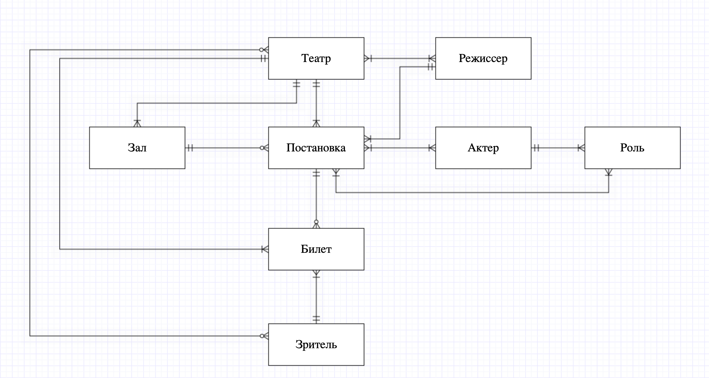

# DatabaseCourse

--------

## ER - модель: Афиша театральных представлений

### Описание сущностей

1. Билет
2. Постановка
3. Театр
4. Зритель
5. Актер
6. Режиссер
7. Роль
8. Зал

### Описание взаимосвязей

1. Билет - Зритель

    * Каждый зритель может иметь множество билетов.

    * У билета один владелец.

2. Зритель - Театр
    * Зритель мог быть посетителем нескольких театров, либо посещать театр впервые. (Статистика посещений конкретных театров)

    * Театр могут посещать много зрителей, либо ни одного. (Дисконтные карты, акции и бан-листы театра)

3. Билет - Постановка
    * Билет однозначно определяет постановку, на которую пойдет зритель.

    * На постановку может быть либо продано много билетов, либо не продан ни один.

4. Билет - Театр
    * Билет однозначно определяет театр, который собирается посетить зритель.

    * Театр может продать много билетов.

5. Постановка - Зал
    * Постановка ставится в одном зале.

    * В одном зале было проведено много представлений.

6. Зал - Театр
    * Конкретный зал принадлежит конкретному театру.

    * Конкретному театру принадлежит много залов.

7. Постановка - Театр
    * Конретная постановка проводится в конкретном театре. (Конкретная == на которую был продан билет)

    * В театре проводится много постановок.

8. Театр - Режиссер
    * В театре работают много режиссеров.

    * Режиссер может работать либо во многих театрах, либо временно ни в одном.

9. Постановка - Режиссер
    * Конкретная постановка была поставлена конкретным режиссером.

    * Режиссер может ставить много постановок.

10. Постановка - Актер
    * В одной постановке играют либо много актеров, либо один.

    * Один актер либо играет в хотя бы одной постановке, либо не играет ни в одной.

11. Актер - Роль
    * Актер может играть несколько ролей. В одной или разных постановках, либо не играть ни одной.

    * Роль может быть сыграна несколькими актерами в разных постановках, либо не быть сыграна никем. (Кастинг еще не завершился)

12. Роль - Постановка
     * В постановке либо одна, либо несколько ролей.

     * Одна роль может быть либо в одной постановке, либо в нескольких.

### Модель

