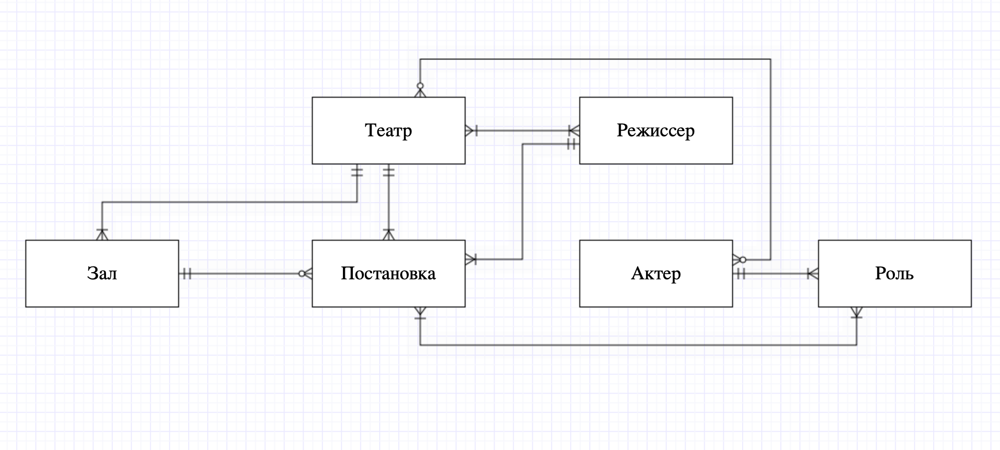

# DatabaseCourse

--------

## Предметная область проекта - Афиша театральных представлений

### Описание сущностей

1. Постановка
2. Театр
3. Актер
4. Режиссер
5. Роль
6. Зал

### Описание взаимосвязей

1. Постановка - Зал
    * Постановка ставится в одном зале.

    * В одном зале было проведено много представлений.

2. Зал - Театр
    * Конкретный зал принадлежит конкретному театру.

    * Конкретному театру принадлежит много залов.

3. Постановка - Театр
    * Конретная постановка проводится в конкретном театре. (Конкретная == на которую был продан билет)

    * В театре проводится много постановок.

4. Театр - Режиссер
    * В театре работают много режиссеров.

    * Режиссер может работать либо во многих театрах, либо временно ни в одном.

5. Постановка - Режиссер
    * Конкретная постановка была поставлена конкретным режиссером.

    * Режиссер может ставить много постановок.

6. Постановка - Актер
    * В одной постановке играют либо много актеров, либо один.

    * Один актер либо играет в хотя бы одной постановке, либо не играет ни в одной.

11. Актер - Роль
    * Актер может играть несколько ролей. В одной или разных постановках, либо не играть ни одной.

    * Роль может быть сыграна несколькими актерами в разных постановках, либо не быть сыграна никем. (Кастинг еще не завершился)

12. Роль - Постановка
     * В постановке либо одна, либо несколько ролей.

     * Одна роль может быть либо в одной постановке, либо в нескольких.

### Модель

#### ER-модель

#### Логическая модель

#### Физическая модель

### Скрипты

1.  - скрипт для удаления всех таблиц.
2.  - скрипт создания моделей базы.
3.  - скрипт для заполнения таблицы данными.
4.  - скрипт с 5 запросами к базе данных и 2 CRUD-запросами.
